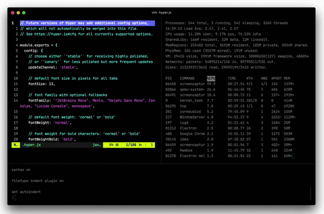

# hyper-highlight-pane

Plugin for [Hyper](https://hyper.is/) that highlights the active pane by reducing opacity of inactive panes.
Compatible with Hyper 3 (previous versions have not been tested). Inspired by
[hyper-simple-highlight-active-session](https://github.com/matheuss/hyper-simple-highlight-active-session) that however
does not work with Hyper 3.



## How to install

```shell script
hyper i hyper-highlight-pane
```

## How to configure

In `.hyper.js` add the following to the `config` object:

```javascript
highlightPane: {
  activeOpacity: 1.0,  // opacity of active pane, float value between 1.0 and 0.0 (default 1.0)
  inactiveOpacity: 0.5 // opacity of inactive panes, float value between 1.0 and 0.0 (default 0.5)
}
```
